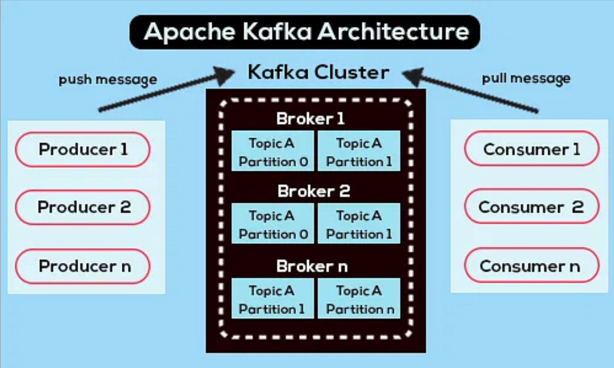

# Apache Kafka

Apache Kafka é uma plataforma distribuída de streaming (recebimento contínuo de dados) projetada para lidar com grandes volumes de dados em tempo real. Ela permite a criação de pipelines de dados e a construção de aplicações que processam eventos de maneira contínua, escalável e confiável.

## Notificação de Eventos

No Kafka, a notificação de eventos ocorre da seguinte forma:
- **Produtores:** Publicam mensagens (ou eventos) em tópicos.
- **Consumidores:** Se inscrevem nesses tópicos para receber e processar as informações em tempo real.

Essa arquitetura facilita a integração entre sistemas, permitindo que cada componente seja notificado imediatamente quando um novo evento ocorre.

## Principais Componentes do Kafka

- **Produtores:** São responsáveis por enviar os dados para os tópicos, gerando os eventos que serão processados.
- **Brokers:** Servidores que compõem o cluster Kafka, armazenando e gerenciando os dados. Eles garantem a distribuição e a persistência das mensagens.
- **Consumidores:** Aplicações ou serviços que se inscrevem em tópicos para ler e processar os eventos.
- **Tópicos:** Categorias ou canais onde os eventos são organizados e publicados.
- **Zookeeper:** Sistema utilizado para coordenar e gerenciar o cluster do Kafka, garantindo a sincronização e o gerenciamento dos brokers (embora versões mais recentes estejam migrando para uma abordagem sem Zookeeper).

Esse conjunto de componentes torna o Kafka uma solução robusta para cenários que exigem alta performance na transmissão e processamento de dados.

  

Link: https://www.youtube.com/watch?v=N2D7hsXHVGk

Link: https://www.youtube.com/live/43d7YWY2w0Y
